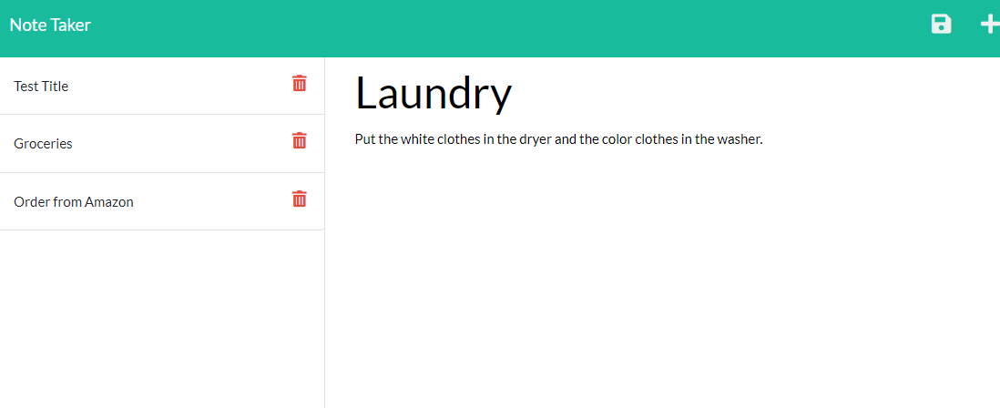

# Note Taker

## Description

The purpose of this project was to create a program using express.js to link the already existing files in the public folder with a server.js file containing all necessary paths and functions to make the program function properly. This program is a simple note taker, allowing the user to insert notes and have them be saved into a database.

## Table of Contents

- [Intallation](#installation)

- [Usage](#usage)

- [Screenshot](#screenshot)

- [Link to the Github Repo](#link-to-the-github-repo)

- [Link to Heroku](#link-to-heroku)

- [Contributions](#contributions)

- [Resources](#resources)

- [License](#license)

## Installation

Simply download the file from my github repo. After that, open the terminal for the folder that you copied from my repo. Once the terminal is open, type npm install. This will allow you to have all of the necessary packages to run my program (ie. express, path, and uuid). 

## Usage

Simply go to the Heroku Link provided below.

You could also open the repo and run npm install. Use the command node server.js and go to the route provided. Then follow the webpage.

If you have other Questions you can refer to the video or refer to my GitHub profile.

## Screenshot

## Link to the GitHub Repo

[Here is the link to my Github Repository](https://github.com/jandrewanderson/note-taker)

## Link to Heroku

[Here is the Link to Heroku](https://note-taker-jaanderson.herokuapp.com/)

### Contributions

Joseph Andrew Anderson

### Resources

https://www.w3schools.com/html/html5_semantic_elements.asp

https://www.pluralsight.com/guides/semantic-html

Key individuals that helped me understand the concepts: 

Kelly Jeffries, Craig Leslie, Neema Velasco, and Vidal Tan.

### License

This code is licensed under the MIT License.

